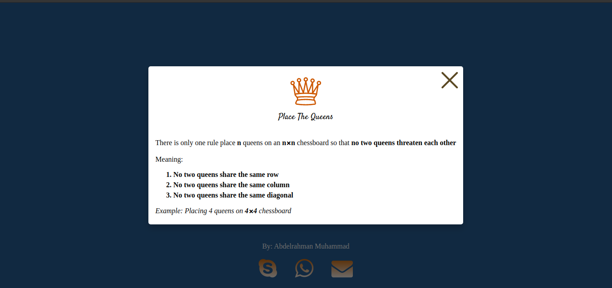
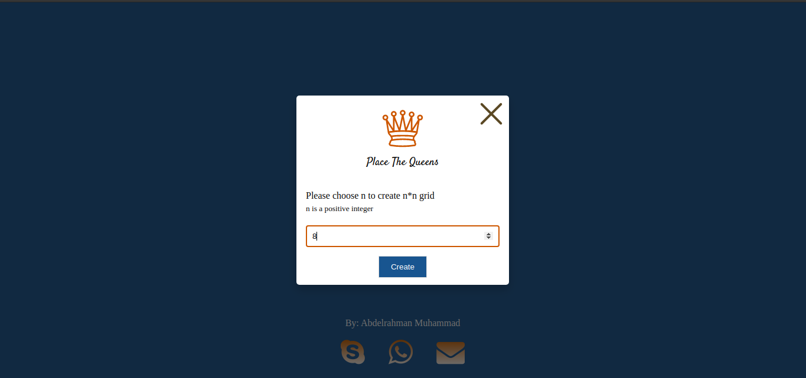
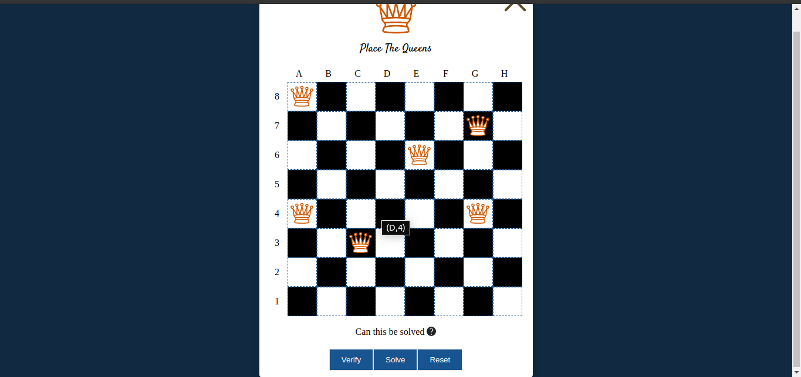

# PlaceTheQueens

The n queens puzzle is the problem of placing n chess queens on an n×n chessboard so that no two queens threaten each other; thus, a solution requires that no two queens share the same row, column, or diagonal.

### Screenshots

